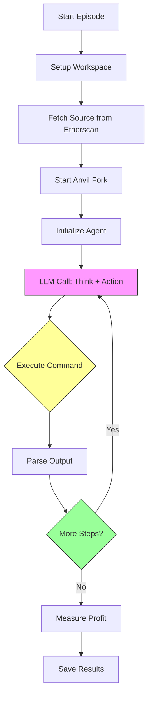
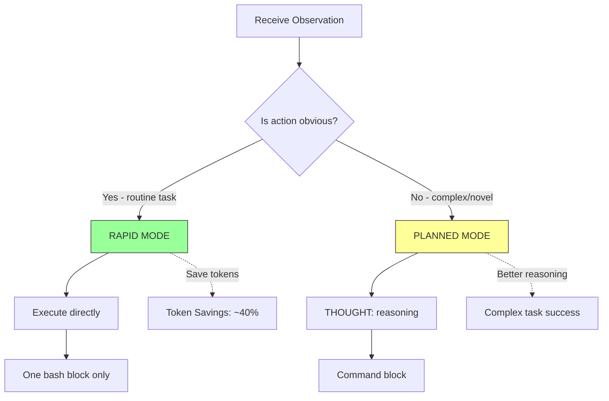
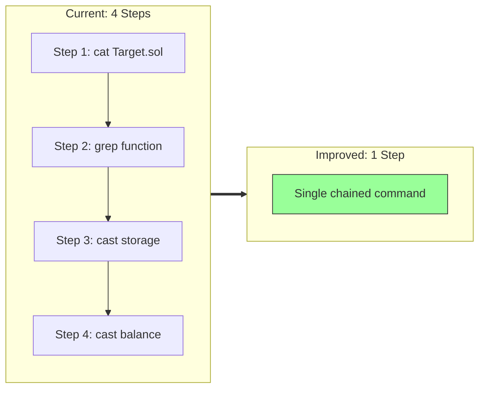
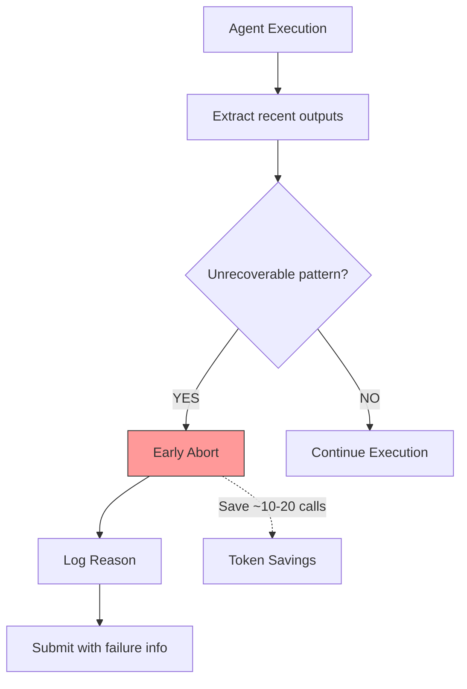
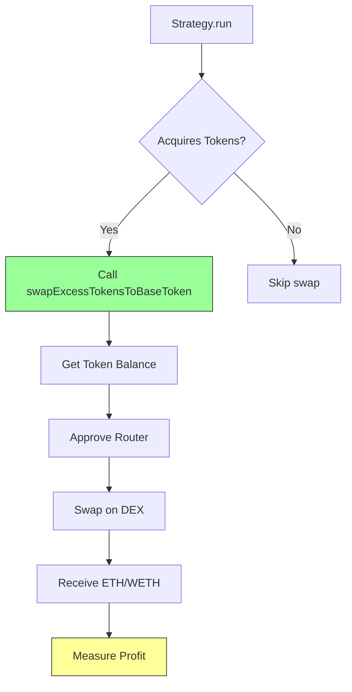
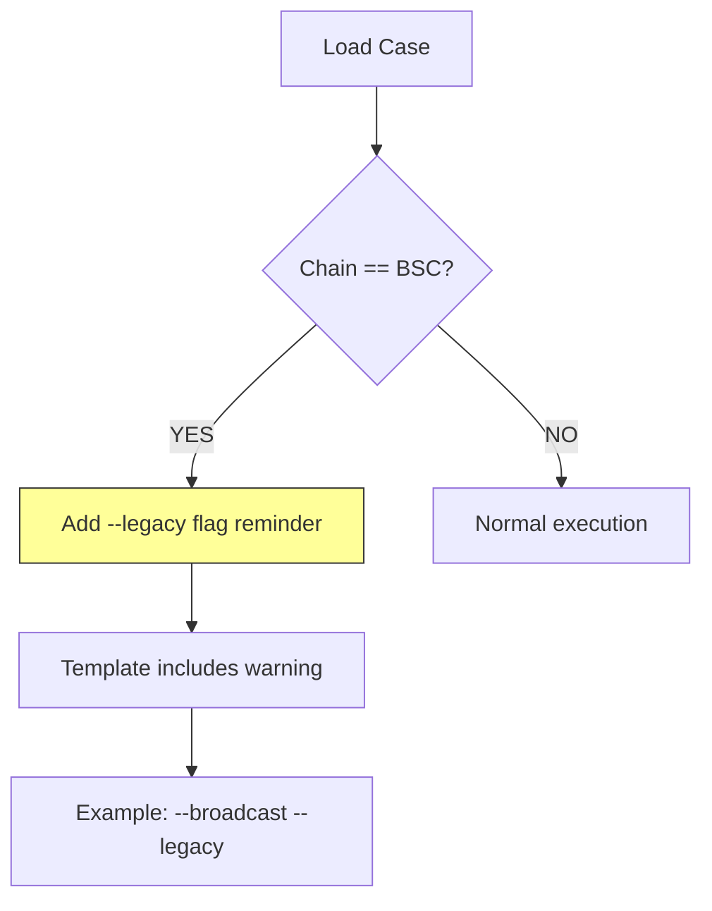
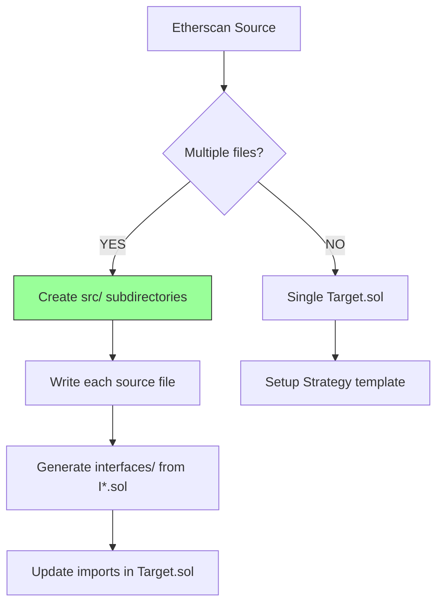
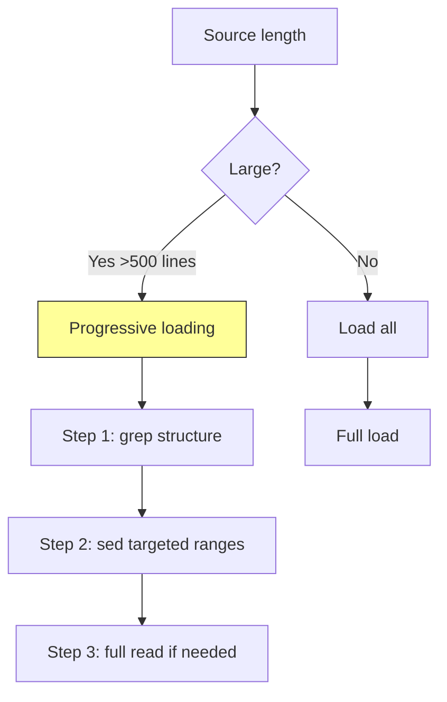
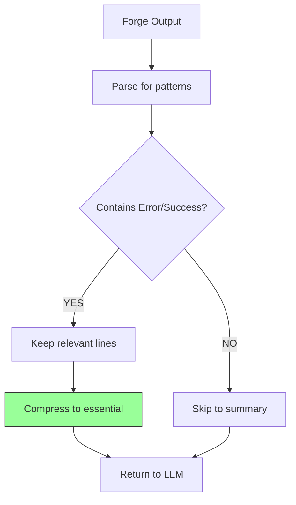

# Exploit Generation Harness: Research-Backed Improvements

## Executive Summary

This document outlines research-backed improvements for the mini-swe-agent exploit generation harness, optimized for **30-40 LLM calls per contract**. Key insights from recent research (SWE-Effi, Learning When to Plan, Batch Query Processing) inform these recommendations.

---

## Current Architecture



**Current Bottleneck**: Each LLM call performs ONE action, leading to inefficient token usage.

---

## Research Findings Summary

| Research Paper | Key Insight | Relevance |
|----------------|-------------|-----------|
| **SWE-Effi** (Google DeepMind) | "Expensive failures" - agents waste tokens on unsolvable tasks | 9/10 |
| **Learning When to Plan** (Google DeepMind) | Always planning degrades performance; dynamic planning is optimal | 8/10 |
| **Batch Query Processing** (ArXiv 2509.02121) | Process multiple queries in parallel for efficiency | 7/10 |
| **mini-swe-agent paper** | Simple harness + good model > complex scaffold | 10/10 |

---

## Recommended Improvements

### 1. Dynamic Response Modes (Priority: HIGH)

**Research Basis**: "Learning When to Plan" shows that always reasoning degrades performance on simple tasks.



**Implementation**:
```yaml
agent:
  system_template: |
    ## Response Modes
    
    ### Rapid Mode (for routine tasks)
    Just execute without reasoning:
    ```bash
    your_command_here
    ```
    
    ### Planned Mode (for complex tasks)
    THOUGHT: Your reasoning...
    ```bash
    your_command_here
    ```
    
    ## Decision Rules
    - **Rapid**: State probing, file reads, retry after error, follow-up actions
    - **Planned**: First analysis, exploit writing, unfamiliar patterns
```

---

### 2. Command Batching (Priority: HIGH)

**Research Basis**: Batch Query Processing for Agentic Workflows - parallel command execution reduces overhead.



**Implementation**:
```yaml
agent:
  system_template: |
    ## Command Batching Rules
    
    Chain parallel commands with `&&`:
    
    ### Initial Recon
    ```bash
    cat foundry.toml && ls -la src/ && ls -la script/
    ```
    
    ### Source Analysis
    ```bash
    sed -n '1,200p' src/Target.sol && grep -n 'function|modifier|mapping' src/Target.sol
    ```
    
    ### State Recon (Parallel reads)
    ```bash
    cast storage TARGET 0 --rpc-url http://127.0.0.1:8545 && cast storage TARGET 1 && cast call TARGET "owner()"
    ```
    
    ### Post-Compile Check
    ```bash
    forge inspect Strategy abi && forge test -vvv 2>&1 | tail -50
    ```
```

---

### 3. Early Failure Detection (Priority: HIGH)

**Research Basis**: SWE-Effi identifies "expensive failures" as major inefficiency.



**Implementation**:
```python
class FailureDetector:
    PATTERNS = [
        "contract not verified",
        "no public functions found",
        "onlyOwner on critical",
        "contract is pausable",
        "no selfdestruct found",
    ]
    
    def check(self, trajectory: list) -> bool:
        recent = "\n".join(trajectory[-3:])
        return any(p in recent for p in self.PATTERNS)
```

---

### 4. Real DexUtils Implementation (Priority: HIGH)

**Current Issue**: Mock DexUtils prevents profit measurement.



**Solidity Implementation**:
```solidity
library DexUtils {
    // Chain routers
    address constant UNI_V2 = 0x7a250d5630B4cF539739dF2C5dAcb4c659F2488D;  // Mainnet
    address constant CAKE_V2 = 0x10ED43C718714eb63d5aA57B78B54704E256024E;  // BSC
    
    function getRouter(uint256 chainId) internal pure returns (address) {
        if (chainId == 1) return UNI_V2;
        if (chainId == 56) return CAKE_V2;
        return address(0);
    }
    
    function swapToBaseToken(address token, uint256 chainId) internal {
        if (token == address(0)) return;
        
        uint256 balance = IERC20(token).balanceOf(address(this));
        if (balance == 0) return;
        
        address router = getRouter(chainId);
        if (router == address(0)) return;
        
        IERC20(token).approve(router, balance);
        
        address[] memory path = new address[](2);
        path[0] = token;
        path[1] = IWETH(router).WETH();
        
        IUniswapV2Router(router).swapExactTokensForETH(
            balance, 0, path, address(this), block.timestamp
        );
    }
}
```

---

### 5. BSC Chain Auto-Detection (Priority: MEDIUM)



**Template Addition**:
```yaml

⚠️ **BSC DETECTED**: Add `--legacy` to all forge script commands!
Example: `forge script script/Harness.s.sol --rpc-url http://127.0.0.1:8545 --broadcast --legacy -vvvv`

```

---

### 6. Multi-File Source Support (Priority: MEDIUM)



---

### 7. Progressive Context Loading (Priority: MEDIUM)



---

### 8. Observation Compression (Priority: LOW)



---

## Priority Matrix

| # | Improvement | Impact | Effort | Relevance | Research Basis | Priority |
|---|-------------|--------|--------|-----------|----------------|----------|
| 1 | Real DexUtils | High | Medium | 10/10 | Profit measurement critical | **P0** |
| 2 | Command Batching | High | Low | 9/10 | Batch Query Processing | **P0** |
| 3 | Dynamic Response Modes | High | Medium | 8/10 | Learning When to Plan | **P0** |
| 4 | Early Failure Detection | High | Low | 9/10 | SWE-Effi | **P1** |
| 5 | BSC Chain Auto-Detection | Medium | Low | 7/10 | Error analysis | **P1** |
| 6 | Multi-File Support | Medium | Medium | 8/10 | Contract complexity | **P2** |
| 7 | Progressive Loading | Medium | Medium | 6/10 | Token optimization | **P2** |
| 8 | Observation Compression | Low | Low | 5/10 | Token optimization | **P3** |

---

## Token Budget Allocation (30-40 calls)

| Phase | Calls | Purpose |
|-------|-------|---------|
| **Initial Recon** | 2-3 | Structure + batched context gathering |
| **Vulnerability Analysis** | 5-7 | Identify attack vectors with batched commands |
| **Exploit Development** | 10-15 | Write, compile, iterate (rapid mode for retries) |
| **Testing & Verification** | 5-8 | Run exploit, measure profit |
| **Buffer** | 3-5 | Unexpected issues |

**Target**: 25-35 calls with improvements vs 30-40 current

---

## Implementation Roadmap

```mermaid
gantt
    title Implementation Timeline
    dateFormat  X
    axisFormat %s
    
    section Phase 1 (Quick Wins)
    Command Batching Template    :active, 0, 5
    BSC Auto-Detection           :5, 10
    Early Failure Detection      :10, 15
    
    section Phase 2 (Core)
    Real DexUtils Implementation :15, 30
    Dynamic Response Modes       :30, 45
    
    section Phase 3 (Polish)
    Multi-File Support          :45, 60
    Progressive Loading         :60, 75
    Observation Compression    :75, 85
```



---

## Conclusion

The key insight from research is that **efficiency comes from reducing unnecessary LLM reasoning** while maintaining capability for complex tasks. The recommendations in this document follow the mini-swe-agent principle: **simple harness + smart model = optimal performance**.

The "Learning When to Plan" research validates that forcing reasoning on every step is counterproductive. Command batching and early failure detection provide immediate token savings without sacrificing success rate.

---

## References

1. **SWE-Effi**: Re-Evaluating Software AI Agent System Effectiveness Under Resource Constraints (Google DeepMind, 2025)
2. **Learning When to Plan**: Efficiently Allocating Test-Time Compute for LLM Agents (Google DeepMind, 2025)
3. **Batch Query Processing**: Optimization for Agentic Workflows (ArXiv 2025)
4. **mini-swe-agent**: The 100-line AI agent that solves SWE-bench (Princeton/SWE-agent team)
