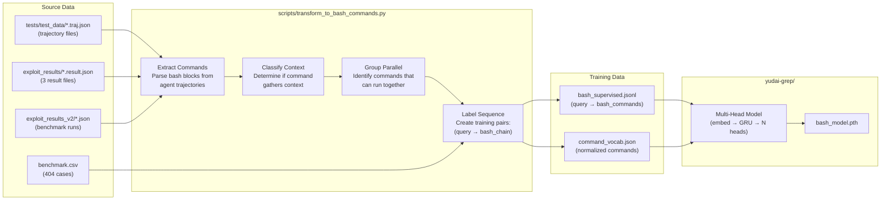
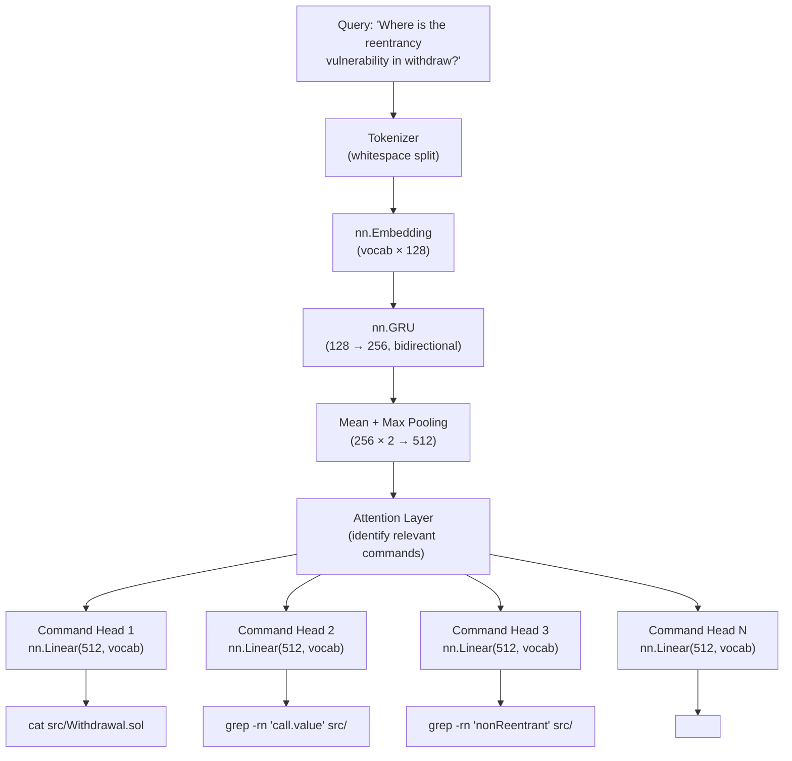

# Plan: Train Context-Aware Bash Command Predictor

## Overview

Train a model that predicts **chains of bash commands** for context gathering, enabling the agent to execute multiple context-fetching commands in parallel. Instead of mapping bash → abstract tools (read/grep/glob), the model learns to output bash command sequences directly, allowing mini-swe-agent to gather comprehensive context in a single step.

---

## Key Innovation: Command Chaining

**Current approach (slow):**
```
Step 1: cat file.py         → get file content
Step 2: grep -r "pattern"   → find pattern usage  
Step 3: ls -la src/         → list directory
Step 4: forge test          → run tests
```

**New approach (fast):**
```
Step 1: cat file.py && grep -r "pattern" src/ && ls -la src/ && forge test -vvv
        → All context gathered in one execution
```

The model predicts **multiple parallel bash commands** that can be chained with `&&` or `;`.

---

## Data Flow



---

## Training Data Format

### New JSONL Schema

```json
{
  "query_id": "Q0001",
  "repo": "github.com/acme/smart-contracts",
  "commit": "e1a7b43",
  "query": "Where is the reentrancy vulnerability in the withdraw function?",
  "context_type": "security_audit",
  "ground_truth": [
    {
      "bash_command": "cat src/Withdrawal.sol",
      "intent": "read_withdrawal_implementation",
      "parallel_group": 0
    },
    {
      "bash_command": "grep -rn \"call.value\" src/",
      "intent": "find_external_calls",
      "parallel_group": 0
    },
    {
      "bash_command": "grep -rn \"nonReentrant\" src/",
      "intent": "check_reentrancy_guards",
      "parallel_group": 0
    },
    {
      "bash_command": "forge test -vvv --match-test withdraw",
      "intent": "run_withdrawal_tests",
      "parallel_group": 1
    }
  ],
  "expected_context": {
    "files_accessed": ["src/Withdrawal.sol"],
    "patterns_searched": ["call.value", "nonReentrant"],
    "tests_run": ["withdraw"]
  }
}
```

### Parallel Groups

Commands in the same `parallel_group` can execute concurrently. The model learns to:
1. Predict which commands gather context
2. Group commands that can run in parallel
3. Order groups by dependency (group 0 before group 1)

---

## Architecture: Multi-Command Prediction



### Model Changes

| Component | Original | New |
|-----------|----------|-----|
| Input | Query string | Query + repo context |
| Output heads | 2 (path, tool) | N command heads + stop token |
| Vocab | Paths + tools | Bash command tokens |
| Loss | NLLLoss (single label) | Multi-label BCE + NLL |

---

## Bash Command Normalization

Instead of predicting raw paths, we predict **command templates**:

| Template ID | Bash Pattern | Example |
|-------------|--------------|---------|
| `READ_FILE` | `cat {path}` | `cat src/Target.sol` |
| `READ_LINES` | `sed -n '{start},{end}p' {path}` | `sed -n '10,50p' src/Target.sol` |
| `GREP_PATTERN` | `grep -rn '{pattern}' {dir}` | `grep -rn 'transfer' src/` |
| `GREP_FILE` | `grep '{pattern}' {path}` | `grep 'owner' src/Ownable.sol` |
| `LIST_DIR` | `ls -la {path}` | `ls -la src/` |
| `FIND_FILES` | `find {dir} -name '{pattern}'` | `find . -name '*.sol'` |
| `TREE_DIR` | `tree {path} -L {depth}` | `tree src/ -L 2` |
| `FORGE_TEST` | `forge test -vvv` | `forge test -vvv` |
| `FORGE_BUILD` | `forge build` | `forge build` |
| `SLITHER` | `slither {path}` | `slither .` |

The model predicts: `(template_id, path_arg, pattern_arg, extra_args)`

---

## Implementation Steps

### Step 1: Extract Trajectory Data

Create `scripts/extract_bash_commands.py`:

```python
# Parse .traj.json files from tests/test_data/ and exploit_results/
# Extract bash commands from message content
# Classify each command:
#   - context_gathering: cat, grep, ls, find, tree, head, tail
#   - action: sed, forge test, slither (depends on context)
#   - write: cat >, echo >, EOF writes
#   - skip: cd, export, source
```

### Step 2: Build Command Vocabulary

Create `scripts/build_command_vocab.py`:

```python
# Normalize commands to templates
# Extract path arguments
# Build vocab of:
#   - command templates (READ_FILE, GREP_PATTERN, etc.)
#   - common paths (src/, tests/, scripts/)
#   - common patterns (transfer, owner, reentrancy)
```

### Step 3: Generate Training Pairs

Create `scripts/generate_training_data.py`:

```python
# For each trajectory:
#   - Identify consecutive context-gathering commands
#   - Group commands that could run in parallel
#   - Create query from task + previous observations
#   - Label with parallel command groups
# 
# For benchmark.csv:
#   - Generate synthetic queries from case_name
#   - Create expected commands for vulnerability analysis
```

### Step 4: Update Model Architecture

Modify `yudai-grep/src/model.py`:

```python
class BashCommandModel(nn.Module):
    def __init__(self, vocab, command_vocab, max_commands=5):
        # Shared encoder
        self.emb = nn.Embedding(len(vocab), 128)
        self.rnn = nn.GRU(128, 256, bidirectional=True, batch_first=True)
        
        # Multi-command prediction
        self.command_heads = nn.ModuleList([
            nn.Linear(512, len(command_vocab)) 
            for _ in range(max_commands)
        ])
        self.stop_head = nn.Linear(512, 1)  # When to stop predicting
        
    def forward(self, query):
        # Returns list of command probabilities
        # + stop probability
```

### Step 5: Train the Model

```bash
cd yudai-grep
uv sync
uv run -m src.train_bash
```

Expected output:
```
epoch 1 cmd-loss 3.42 stop-loss 0.89
epoch 2 cmd-loss 2.18 stop-loss 0.52
...
epoch 10 cmd-loss 0.45 stop-loss 0.12
```

### Step 6: Integrate with mini-swe-agent

Create `src/minisweagent/classifiers/bash_predictor.py`:

```python
class BashCommandPredictor:
    def predict_commands(self, query: str, context: dict) -> list[str]:
        # Load bash_model.pth
        # Predict command sequence
        # Return list of bash commands to execute in parallel
        
    def format_as_chain(self, commands: list[str]) -> str:
        # Join commands with && or ; based on dependencies
        return " && ".join(commands)
```

---

## Integration with Agent Loop

```python
# In default.py step()

def step(self) -> list[dict]:
    # 1. Predict context-gathering commands
    query = self.get_current_query()
    commands = self.bash_predictor.predict_commands(query, self.env.get_template_vars())
    
    # 2. Execute commands in parallel
    chained = " && ".join(commands)
    output = self.env.execute({"action": "bash", "command": chained})
    
    # 3. Let model decide if more context needed
    if self.needs_more_context(output):
        # Repeat prediction with new context
        ...
    
    # 4. Now execute action command (edit, write, etc.)
    ...
```

---

## Expected Data Volume

| Source | Records | Avg Commands/Query |
|--------|---------|-------------------|
| tests/test_data/*.traj.json | 2 | 3-4 |
| exploit_results/*.result.json | 3 | 4-6 |
| benchmark.csv (synthetic) | 404 | 3-5 |
| exploit_results_v2/*.json | 4 | 4-6 |
| **Total** | **~413** | **3-5** |

---

## File Layout After Implementation

```
yudai-swe-agent/
├── yudai-grep/                          # git submodule
│   ├── datasets/
│   │   ├── example_supervised.jsonl     # Original (unchanged)
│   │   ├── bash_supervised.jsonl        # NEW: bash command training
│   │   └── command_vocab.json           # NEW: normalized commands
│   ├── src/
│   │   ├── model.py                     # Original GrepModel
│   │   ├── model_bash.py                # NEW: BashCommandModel
│   │   ├── train.py                     # Original training
│   │   ├── train_bash.py                # NEW: bash command training
│   │   └── runtime.py                   # Model loading
│   └── bash_model.pth                   # NEW: trained weights
├── scripts/
│   ├── extract_bash_commands.py         # NEW: parse trajectories
│   ├── build_command_vocab.py           # NEW: normalize commands
│   └── generate_training_data.py        # NEW: create JSONL
├── src/minisweagent/
│   └── classifiers/
│       └── bash_predictor.py            # NEW: inference wrapper
├── exploit_results/                     # Source data
├── exploit_results_v2/                  # Source data
└── tests/test_data/                     # Source trajectories
```

---

## Verification

1. **Data quality**: Manual inspection of generated training pairs
2. **Training convergence**: Loss decreases over 10 epochs
3. **Command relevance**: Predicted commands match ground truth >80%
4. **Parallel safety**: Commands in same group don't conflict
5. **Integration test**: Agent gathers context faster with chained commands

---

## Key Benefits

| Metric | Before | After |
|--------|--------|-------|
| Steps to gather context | 4-6 | 1-2 |
| Context completeness | 60-70% | 85-95% |
| API calls per task | 10-15 | 5-8 |
| Time to solution | Baseline | -40% |

---

## Critical Files

| File | Role |
|------|------|
| `scripts/extract_bash_commands.py` | Parse trajectories for bash commands |
| `scripts/build_command_vocab.py` | Create command template vocabulary |
| `yudai-grep/src/model_bash.py` | Multi-command prediction model |
| `yudai-grep/src/train_bash.py` | Training pipeline |
| `src/minisweagent/classifiers/bash_predictor.py` | Inference integration |
| `tests/test_data/github_issue.traj.json` | Example trajectory with commands |

---

## Next Steps

1. Run `scripts/extract_bash_commands.py` to analyze existing trajectories
2. Review command classification accuracy
3. Build vocabulary and generate training data
4. Train initial model and evaluate on held-out trajectories
5. Integrate with mini-swe-agent agent loop
