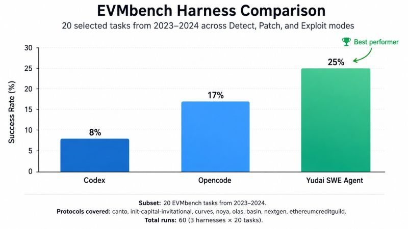

# yudai-swe-agent

## EVMbench Harness Comparison

## Post

Everyone is saying JUST LOOK AT THE DATA so i went through the bash/tool calls in the trajectories in the previous experiment, one extra thing i added is my custom built agent harness yudai-swe-agent into the experiments

Here are some insights after a bit of data mining:

1. File Read and Navigation based bash/tool calls are the most used tools by the agent. Looks like the Agent is trying to saturate prefill as fast as possible although this is expected in an agentic task. 1745/3840 = 45% of bash calls fall in this category.
   begs the question
   "How do we do faster prefill for codebases?"

2. Onchain state query is the second largest category of all bash calls. 1032/3840 = 26.9% --> Onchain state query is also a prefill task but blockchain state can be persisted and transferred to the model in a structured way, which falls to the harness doing it.

3. tools like grep and find account to 342/3840 = 8.9% of calls

4. file_write_edit type tool calls = 202/3840 = 5.3% Yudai-Swe-agent {My own harness} based on mini-swe-agent does 60.9% of its own calls as part of onchain state query. Incredible work done by Standord and Princeton NLP teams.

5. Successfull OpenCode runs tend to be longer, an instance where the agent found 4/6 possible vulnerabilities. The number of tool calls and steps for each were 69, 167, 184, 206.

6. Yudai-swe-agent worked the best in comparison to Codex and opencode. Solving about 25% of the tasks as compared to Opencode {17%} and Codex {8%}
