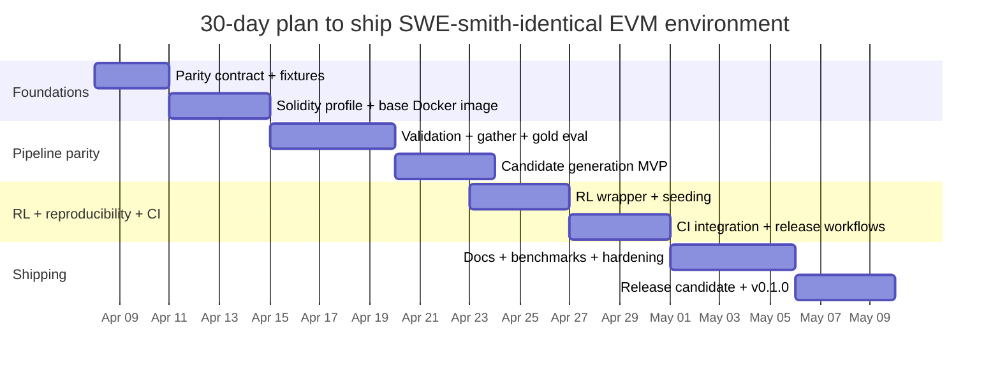

# Deep research report on modifying evmSmith to ship a SWE-smith‑identical RL environment in 30 days

## Executive summary

evmSmith is currently an unmodified fork of the upstream toolkit, so the “SWE-smith surface area” (CLI scripts, dataset artifacts, harnesses, profiles, Docker image workflow, and training helpers) already exists in the codebase under the `swesmith/` package. citeturn2view0turn27view0 The core work to “create and ship an RL environment identical to SWE-smith” is therefore not about inventing new scaffolding; it is about (a) preserving the SWE-smith contract (artifact formats, keys, logs layout, evaluation semantics, and Docker-driven determinism), while (b) adding an EVM/Smart‑Contract execution stack (Solidity entity extraction + Foundry/Hardhat testing + a Solidity profile registry + “repo → image → task instances → validate → gather → eval” parity), and (c) packaging/releasing it as a distinct product (PyPI name, Docker org, CI) without breaking the SWE-smith conventions users rely on. citeturn27view1turn28view0turn44view0

The “identical” target should be defined as **interface and artifact parity**, not identical internal implementations. SWE-smith’s public contract includes: (1) **environment images** built or downloaded via `build_repo/create_images` and `build_repo/download_images`, (2) **task instances** as diffs plus metadata under `logs/bug_gen/<repo>`, (3) **validation** that computes `FAIL_TO_PASS` and `PASS_TO_PASS` and emits per-instance log folders with `eval.sh`, `patch.diff`, `report.json`, and `test_output.txt`, (4) **dataset gathering** into `logs/task_insts/<run_id>.json` plus creation of remote branches per instance, and (5) **evaluation** that re-runs tests in the container and reports resolution. citeturn27view2turn28view0turn48view2

A realistic 30‑day ship plan (assuming no specific constraints on team size/compute) is to deliver a **minimal parity slice** first (Solidity profile + Foundry test execution + log parsing + dataset/harness parity + packaging + CI), then expand bug generation methods and scale-out automation as “post‑ship hardening.” This report provides: (1) a component→file/class mapping for the current fork, (2) a prioritized divergence backlog for adding an EVM RL environment while keeping SWE-smith parity, (3) a daily/weekly 30‑day schedule with hours, dependencies, tests, and acceptance criteria, (4) a code-level change plan (files/APIs/data/config), (5) CI/CD + packaging/release steps (Docker + PyPI + GitHub Actions) with reproducibility hooks, (6) a risk register with mitigations, and (7) required resources (compute/libs/roles). citeturn27view1turn28view0turn33view0turn44view0

**Key assumption (explicit):** The purpose of evmSmith is to become an **EVM/Smart‑Contract analogue** of SWE-smith while remaining **SWE-smith‑compatible at the interface and artifact level** (same dataset keys/log layout/CLI semantics), rather than simply re‑publishing SWE-smith unchanged. This is inferred from the repo name and the requested scope (“modify the fork” + “ship an RL environment identical to SWE-smith”). If instead the goal is only to wrap SWE-smith itself as an RL environment, many EVM‑specific tasks below can be skipped and the schedule compresses substantially.

## Baseline definition of SWE-smith parity

SWE-smith describes itself as a pipeline that converts repositories into “reinforcement learning environments,” with two initial steps: (1) install a repo and run its tests, then (2) construct an execution environment (a Docker image). citeturn27view1 Its public workflow then synthesizes many “task instances” (bugs) that break existing tests, validates which instances are usable (break 1+ tests), gathers validated instances into a dataset, optionally generates issue text, and evaluates solutions by running tests in the same containerized environment. citeturn27view2turn28view0turn28view1

The parity-critical artifacts and semantics that your evmSmith-based product must preserve are:

- **Execution environments as Docker images**:
  - Built by `python -m swesmith.build_repo.create_images …` and verified by running the container and executing the test suite. citeturn27view1turn12view0
  - Downloadable prebuilt images using `python -m swesmith.build_repo.download_images`. citeturn27view1turn14view0
  - SWE-smith even maintains a dedicated “env ledger” repo explaining that images are pushed to a Docker registry and that the env repo exists primarily for reproducibility of image builds. citeturn41view0

- **Task instances (bugs) as diffs + metadata under `logs/bug_gen/<repo>`**:
  - Each candidate instance is generally a `bug__<bug_type>__<hash>.diff` plus `metadata__<bug_type>__<hash>.json`. citeturn27view2

- **Validation harness**:
  - Collect candidates into a `<repo>_all_patches.json`, run per-instance validation by running tests pre‑ and post‑patch, and produce `FAIL_TO_PASS` and `PASS_TO_PASS`. citeturn28view0turn17view0turn48view2
  - Validation logs for each instance include `eval.sh`, `patch.diff`, `report.json`, and `test_output.txt`. citeturn28view0turn48view2

- **Dataset gathering**:
  - Gather only instances with ≥1 `FAIL_TO_PASS` and ≥1 `PASS_TO_PASS` into `logs/task_insts/<run_id>.json`. citeturn28view0turn18view1
  - Create a dedicated branch per instance that contains the buggy code state (and, in SWE-smith’s implementation, an extra commit removing F2P test files for some workflows). citeturn18view1turn48view2

- **Evaluation harness**:
  - Evaluate a prediction patch by running the test suite inside the corresponding image and grading resolution based on the `FAIL_TO_PASS`/`PASS_TO_PASS` semantics. citeturn28view0turn17view1turn18view0

This baseline is reinforced by SWE-smith’s published scope and dataset scale (50k+ instances sourced from 128 GitHub repos, and public release of assets). citeturn42view0turn43view0turn29view0turn4view0

## Component-to-code mapping for SWE-smith features in evmSmith

Because evmSmith is an unmodified fork, SWE-smith components map directly to the same file paths and classes. citeturn2view0 The table below is organized by “what users rely on” rather than internal structure.

### Feature mapping table

| SWE-smith component / user-visible feature | evmSmith location (files/classes) | Notes on how it works (parity-relevant) |
|---|---|---|
| Install & build execution environments (Docker images) | `swesmith/build_repo/create_images.py`; `swesmith/profiles/base.py` (`RepoProfile.create_mirror()`, `RepoProfile.build_image()`) | `create_images` builds images for `registry.values()` and can push images. citeturn12view0turn21view0turn39view3 |
| Download prebuilt environments | `swesmith/build_repo/download_images.py` | Pulls images from a Docker registry and filters image names by prefix. citeturn14view0turn13view0 |
| Repository profile registry (the “environment spec”) | `swesmith/profiles/base.py` (`Registry`, global `registry`); `swesmith/profiles/__init__.py` | `Registry.get()` and `get_from_inst()` resolve the correct profile from an instance dict; profiles define `test_cmd` and `log_parser()`. citeturn39view3turn22view0turn39view0 |
| Instantiate a runnable container for an instance | `swesmith/profiles/base.py` (`RepoProfile.get_container`) | Creates a container from `image_name`, checks out instance branch, and enforces Docker user/workdir conventions. citeturn39view2turn21view0 |
| Bug generation: LM Modify / LM Rewrite | `swesmith/bug_gen/llm/*` (e.g., `modify.py`, `rewrite.py`); docs commands | The docs define that SWE-smith extracts programmatic entities and prompts a model to modify/rewrite them. citeturn27view2 |
| Bug generation: procedural AST modifications | `swesmith/bug_gen/procedural/*`; adapters under `swesmith/bug_gen/adapters/*` | Procedural techniques operate on parsed entities/AST; adapters provide language parsing and build `CodeEntity` objects. citeturn27view2turn46view0turn45view0 |
| Bug generation artifacts layout | `logs/bug_gen/<repo>/...` conventions + collection scripts | Docs specify `.diff` + `metadata.json` naming and hashing over diff contents. citeturn27view2 |
| Collect candidate patches | `swesmith/bug_gen/collect_patches.py` (invoked by docs) | Produces `logs/bug_gen/<repo>_all_patches.json`. citeturn28view0 |
| Validation harness (usable instance detection) | `swesmith/harness/valid.py`; `swesmith/harness/grading.py`; `swesmith/harness/utils.py` | Runs tests pre/post, writes `report.json` including `FAIL_TO_PASS` and `PASS_TO_PASS`. citeturn17view0turn18view0turn48view2 |
| Dataset gathering (+ branch creation) | `swesmith/harness/gather.py` | Writes `logs/task_insts/<run_id>.json` and creates per-instance branches on the mirror repo. citeturn18view1turn28view0 |
| Evaluation harness (grade predicted patch) | `swesmith/harness/eval.py`; `swesmith/harness/grading.py`; `swesmith/harness/utils.py` | Runs patch in container, parses logs between `TEST_OUTPUT_START/END`, computes resolved. citeturn17view1turn18view0turn48view2 |
| Test log parsing per project/language | `swesmith/profiles/*` (e.g. `PythonProfile.log_parser`) | `log_parser()` maps test case→status; Python example parses PyTest lines. citeturn38view0turn39view0 |
| Issue text generation | `swesmith/issue_gen/*` + configs under `configs/issue_gen/*` | Produces `problem_statement` and logs `logs/issue_gen/<experiment>/<repo>/...`. citeturn28view1turn23view0 |
| Packaging and extras | `pyproject.toml` | Uses optional dependency groups (`all`, `generate`, `validate`, etc.). citeturn44view0 |
| CI for tests + docs | `.github/workflows/pytest.yaml`, `build-docs.yaml` | Pytest workflow uses `uv`, Python 3.10, coverage upload; docs workflow builds/deploys MkDocs. citeturn33view0turn34view0 |

## Missing features and divergences for an EVM SWE-smith‑identical environment

If evmSmith’s goal is EVM/Smart‑Contract task instances with SWE-smith parity, the fork currently lacks **domain-specific profiles, parsers, and reproducible assets**. The backlog below is prioritized by what blocks a first “identical pipeline run” (build env → generate/ingest instances → validate → gather → eval) on at least one Solidity repo.

### Divergence and implementation backlog

| Priority | Missing / divergent capability (relative to desired EVM SWE-smith parity) | Why it blocks parity | Where to implement (files/modules) | Acceptance test (parity check) |
|---|---|---|---|---|
| P0 | **Solidity/EVM RepoProfile** (test command + Dockerfile + log parsing) | Without a profile, the harness cannot run tests nor parse statuses into `FAIL_TO_PASS` / `PASS_TO_PASS`. Base requires `dockerfile` and `log_parser()`. citeturn39view0turn48view2 | Add `swesmith/profiles/solidity.py`; update `swesmith/profiles/__init__.py` and registry “skip base types” list in `profiles/base.py`. citeturn22view0turn39view3 | Build an image and run `forge test` inside it; run validation and produce a `report.json` with ≥1 `FAIL_TO_PASS` and ≥1 `PASS_TO_PASS`. citeturn28view0turn48view2 |
| P0 | **Forge/Hardhat test-output parser** mapped to `TestStatus` semantics | SWE-smith grading relies on parsing test outputs between markers, then mapping test cases to statuses. citeturn18view0turn48view2 | Implement in `SolidityProfile.log_parser()` and optional helper module `swesmith/harness/evm_log_parsers.py` | Unit test that parser extracts stable test identifiers and statuses from recorded logs, and grading pipeline marks gold patches resolved. citeturn18view0turn17view1 |
| P0 | **EVM-compatible Docker base image** + deterministic toolchain pinning | Parity expects reproducible Docker execution environments and downloadable images. citeturn27view1turn41view0 | Add env artifacts in a new `env/` or `docker/` folder; integrate with `RepoProfile.dockerfile` / `build_image()` | Rebuild image yields identical tool versions; running tests inside container is deterministic across runs (seeded). |
| P0 | **Namespace/productization**: decide whether to ship as `swesmith` (conflicting) or a new package name | You cannot safely publish an “evmSmith” fork to entity["organization","PyPI","python package index"] using the same project name (`swesmith`) without clobbering semantics; packaging metadata currently says `name="swesmith"`. citeturn30view0turn44view0 | Update `pyproject.toml`, module namespace strategy, docs, and image naming convention | `pip install evmsmith` (or chosen name) installs cleanly; import path works; CLI examples run. citeturn27view0turn44view0 |
| P1 | **Solidity entity extraction adapter** (Tree-sitter or alternative) | LM Modify/Rewrite and procedural generation begin by extracting “programmatic entities.” SWE-smith adapters exist for many languages but not Solidity. citeturn27view2turn45view0turn46view0 | Add `swesmith/bug_gen/adapters/solidity.py`; include Solidity grammar dependency in `pyproject.toml`; wire into `extract_entities()`. citeturn21view0turn44view0 | Run entity extraction over a Solidity repo and confirm entities include file paths + code snippets as `CodeEntity`. citeturn46view0turn21view0 |
| P1 | **EVM task instance generation strategy** (at least one) | To be SWE-smith‑like, you need a way to create candidate diffs and metadata under `logs/bug_gen/<repo>`. citeturn27view2 | Minimum viable: LLM Modify for Solidity; optional procedural transformations | `logs/bug_gen/<repo>` contains `bug__...diff` + `metadata__...json` and can be collected + validated. citeturn27view2turn28view0 |
| P1 | **Fix hard-coded x86_64 container platform** for multi-arch reproducibility | `run_patch_in_container` sets `platform="linux/x86_64"` even though profiles support `arch`, risking mismatch on arm64. citeturn21view0turn48view2 | Update `swesmith/harness/utils.py` and `RepoProfile.get_container()` to use `rp.pltf` or `rp.arch`. citeturn39view2turn48view2 | On arm64 host, evaluation/validation still launches containers with the correct platform. |
| P2 | **Issue text generation templates appropriate for smart contracts** | SWE-smith can generate issue text via LMs; EVM tasks need domain phrasing (vulnerability description, exploit conditions). citeturn28view1 | Extend `configs/issue_gen/*` and prompts; no harness changes required | Generated `problem_statement` is present and semantically aligned; pipeline produces `logs/issue_gen/...`. citeturn28view1turn28view0 |
| P2 | **Benchmarks + parity metrics** | “Identical” requires measurable parity checks (schema, harness outputs, determinism). citeturn28view0turn48view2 | Add `tests/` and `benchmarks/` scripts; add CI jobs | CI runs “mini benchmark” and publishes a report artifact. |
| P3 | Scale-out tooling (Modal, large-scale bug gen, image publishing ledger) | Helpful for reaching SWE-smith scale, but not required for initial parity ship. citeturn27view2turn41view0 | Later milestone | Only after P0–P1 ship. |

## Thirty-day milestone schedule with daily tasks, hours, dependencies, testing, and acceptance criteria

### Capacity assumptions

- **No specific constraint** given; the schedule below assumes **one primary engineer** at ~6 focused hours/day (≈180 hours over 30 days), plus ad-hoc review time. Adjust linearly for more staff.  
- Docker builds and test runs are assumed feasible on a dev workstation; larger-scale dataset/image generation is treated as “stretch” beyond the day‑30 ship. citeturn27view1turn41view0

### Milestone definitions (week-level)

| Week | Milestone | Outputs | “Done when” acceptance gate |
|---|---|---|---|
| Week 1 | Parity contract + EVM execution skeleton | Solidity profile stub, base Docker image, log parser prototype, packaging decision | Can build and run a Solidity repo’s tests in Docker via the SWE-smith harness entrypoints. citeturn27view1turn48view2 |
| Week 2 | End-to-end pipeline on a small repo | Candidate diffs exist; validation produces reports; gather builds dataset JSON | `logs/run_validation/.../report.json` contains valid `FAIL_TO_PASS`/`PASS_TO_PASS`, and `logs/task_insts/<run_id>.json` is produced. citeturn28view0turn18view1 |
| Week 3 | RL environment wrapper + determinism + CI | `RepoEnv` wrapper, seed plumbing, unit tests, GitHub Actions green | CI runs unit tests + “mini integration” (build small image + run eval on 1 instance). citeturn33view0turn48view2 |
| Week 4 | Shipping: Docker + PyPI + docs + benchmarks | Release workflow, versioning, docs quickstart, baseline benchmark report | Public install works, Docker images published, and parity benchmark is reproducible from docs. citeturn27view0turn27view1turn41view0 |

### Daily plan (Day 1 = 2026-04-08 Asia/Kolkata)

The day-by-day plan is intentionally concrete and test-driven; “acceptance tests” are the non-negotiable parity checks that must pass.

| Day | Tasks (deliverable-focused) | Effort (hrs) | Dependencies | Testing criteria (same-day) | Acceptance tests (must pass before moving on) |
|---|---|---:|---|---|---|
| Day 1 | Lock parity contract: define “identical” keys/log paths/CLI; choose package name + Docker org naming; create tracking doc | 6 | None | Checklist review against SWE-smith docs (build env, harness outputs) citeturn27view1turn28view0 | Signed-off parity matrix (schema + commands + outputs) |
| Day 2 | Create minimal Solidity repo fixture (tiny Foundry project) + capture golden `forge test` output logs | 6 | Day 1 | Running tests inside local Docker manually | Golden log stored for parser unit tests |
| Day 3 | Implement `swesmith/profiles/solidity.py` skeleton: `dockerfile`, `test_cmd`, `log_parser()` stub; wire import in `profiles/__init__.py` | 6 | Day 2 | Unit test imports + registry resolution via `Registry.get()` citeturn39view3turn22view0 | `registry` resolves Solidity profile without exceptions |
| Day 4 | Build EVM base Dockerfile (pin Foundry version); implement `dockerfile` generation for SolidityProfile | 6 | Day 3 | `docker build` completes; `forge test` works inside container | `python -m swesmith.build_repo.create_images -r <solidity repo>` builds an image and runs tests in-container. citeturn27view1turn12view0 |
| Day 5 | Implement Forge log parser: map test identifiers to pass/fail statuses compatible with grading expectations | 6 | Day 2–4 | Parser unit tests over captured logs | `log_parser()` returns stable keys; failures detected predictably citeturn18view0turn38view0 |
| Day 6 | Fix hard-coded platform issues: use profile architecture in `run_patch_in_container` and `get_container` | 5 | Day 4 | Run unit test verifying container create uses expected platform | Containers launch on x86_64 and arm64 (simulated by config) citeturn48view2turn39view2 |
| Day 7 | Integration: run validation harness on 1 hand-made “bug” diff; ensure logs emitted as SWE-smith expects | 6 | Day 5–6 | Execute `run_patch_in_container` with patch; confirm log folder structure citeturn48view2turn28view0 | `logs/run_validation/<run_id>/<instance_id>/{eval.sh,patch.diff,report.json,test_output.txt}` exist citeturn28view0turn48view2 |
| Day 8 | Implement minimal candidate instance ingestion: produce `bug__...diff` + `metadata__...json` in SWE-smith layout for Solidity repo | 6 | Day 7 | Validate naming and hashing conventions | `logs/bug_gen/<repo>` contains diff+metadata with expected layout citeturn27view2 |
| Day 9 | Wire `collect_patches` flow for Solidity candidates; ensure output JSON is compatible with `harness.valid` | 5 | Day 8 | Run `python -m swesmith.harness.valid <repo>_all_patches.json` | Validation runs end-to-end and produces reports citeturn28view0turn17view0 |
| Day 10 | Implement/adjust `SolidityProfile.get_test_files()` (optional) to support f2p-only evaluation, mirroring SWE-smith semantics | 6 | Day 9 | Unit test that f2p-only mode filters tests | Evaluation harness respects `f2p_only` toggle citeturn17view1turn48view2 |
| Day 11 | Run `harness.gather` on validated outputs; confirm dataset JSON includes required keys | 6 | Day 9–10 | Inspect `logs/task_insts/<run_id>.json` schema | Must include `instance_id`, `repo`, `patch`, `FAIL_TO_PASS`, `PASS_TO_PASS`, `image_name` citeturn28view0turn18view1 |
| Day 12 | Make evaluation (“gold”) pass: run `harness.eval --predictions_path gold` on gathered dataset | 6 | Day 11 | Eval creates logs and sets `resolved=True` for gold | `python -m swesmith.harness.eval … --predictions_path gold` resolves correctly citeturn28view0turn17view1 |
| Day 13 | Start productization: rename project metadata (PyPI name, URLs), pick module strategy (keep `swesmith` vs add `evmsmith`) | 6 | Day 1 | Build wheel locally; install into venv | `pip install .` produces intended import path; no collision with upstream metadata citeturn44view0turn27view0 |
| Day 14 | Add RL wrapper API (minimal): `RepoEnv.reset()` / `step_patch()` around `run_patch_in_container` | 6 | Day 12–13 | Unit tests for reset/step on fixture instance | Wrapper returns observation + reward consistent with `FAIL_TO_PASS` / `PASS_TO_PASS` grading |
| Day 15 | Add reproducibility controls: global seed plumbing for any stochastic steps; document deterministic Docker tool versions | 6 | Day 14 | Re-run same generation twice and diff outputs | With fixed seed, artifact diffs are byte-identical (or defined stable fields only differ) |
| Day 16 | Expand bug generation MVP: implement LM Modify prompts for Solidity (config + prompt templates) | 6 | Day 15 | Dry-run prompt rendering; “mock LLM” tests | Generates at least N candidate diffs in correct layout citeturn27view2turn28view0 |
| Day 17 | Add 1 procedural Solidity transformation (e.g., require inversion or operator flip) using an AST/Tree-sitter adapter | 6 | Day 16 | Unit test transformation is syntactically valid | Produced diff applies cleanly and can be validated |
| Day 18 | Implement Solidity entity extraction adapter (`bug_gen/adapters/solidity.py`) and add dependency | 6 | Day 17 | Extract entities from fixture repo | Entities include correct file paths + snippets via shared adapter utilities citeturn46view0turn45view0 |
| Day 19 | End-to-end: generate candidates via LM/procedural → collect → validate → gather → eval | 6 | Day 18 | Full pipeline run on fixture repo | At least 3 validated instances, all evaluable; gold eval succeeds citeturn28view0turn17view1 |
| Day 20 | CI upgrades: add “mini integration test” job (build small image + run one eval) | 6 | Day 19 | GitHub Actions passes in fork | `.github/workflows/pytest.yaml` green; integration job uses Docker runner citeturn33view0 |
| Day 21 | Add release workflows: PyPI publish on tag; Docker push on tag; version bump policy | 6 | Day 20 | Dry-run in a test repo / local act | Tagged release produces wheel + pushes images to registry like SWE-smith env ledger expects citeturn41view0turn44view0 |
| Day 22 | Documentation: create “quickstart” mirroring SWE-smith steps but for EVM repos; update examples | 6 | Day 21 | Docs build locally (`mkdocs build`) | Docs show commands equivalent to SWE-smith quickstart (build env, create instances, validate/eval) citeturn27view1turn28view0turn34view0 |
| Day 23 | Add benchmark script: measure %valid instances, avg runtime, deterministic hash rates | 6 | Day 22 | Benchmark runs on fixture | Baseline metrics emitted as JSON and stored in CI artifact |
| Day 24 | Harden harness: better error messages, timeouts, resource limits for EVM tests | 5 | Day 23 | Fault-injection tests (timeout, failing patch apply) | `APPLY_PATCH_FAIL` and timeout behaviors match harness expectations citeturn48view2turn18view0 |
| Day 25 | Issue generation adaptation: Solidity vulnerability-oriented templates + optional LM issue gen prompt | 6 | Day 24 | Generate `problem_statement` for dataset | Output file `logs/issue_gen/<repo>__...json` includes problem statements citeturn28view1turn28view0 |
| Day 26 | Packaging polish: extras groups for EVM (`evm`, `forge`), dependency pinning, license/readme | 6 | Day 25 | `pip install .[evm]` works cleanly | Install + quickstart works from clean venv |
| Day 27 | Reproducibility audit: deterministic seeds + pinned versions + container digests documented | 5 | Day 26 | Re-run pipeline twice on fresh machine | Outputs match expected checksums; benchmark reproducible |
| Day 28 | Release candidate: tag `v0.1.0-rc1`, publish to test registry, run smoke tests from docs | 6 | Day 27 | Install from published artifact | All acceptance tests run from README/quickstart without manual fixes |
| Day 29 | Fixes from RC; finalize release notes and parity statement (“identical contract”) | 6 | Day 28 | Regression tests | CI green; docs updated; version bumped |
| Day 30 | Ship `v0.1.0`: publish PyPI + Docker images + benchmark report; freeze checksums for sample dataset | 6 | Day 29 | Release pipeline success | Public install + one-command smoke test replicates SWE-smith experience end-to-end citeturn27view0turn27view1turn28view0turn41view0 |

### Timeline diagram (milestone-level)



## Code-level change plan for SWE-smith parity

This section lists the concrete file changes, API contracts, data formats, and configuration knobs needed to implement the backlog.

### Architecture: keep SWE-smith harness contract, add EVM profile + env wrapper

The lowest-risk approach is to **avoid rewriting harness logic** and instead extend the “profile layer” so that all existing harness machinery continues to work (it already knows how to: pull/build images, start containers, apply patches as diffs, generate `eval.sh` with test-output markers, run with timeouts, and grade). citeturn48view2turn18view0turn39view0

```mermaid
flowchart LR
  A[RepoProfile: SolidityProfile] --> B[Docker image build/pull]
  B --> C[Container start + checkout instance branch]
  C --> D[Apply patch.diff in container]
  D --> E[Run eval.sh: forge test between markers]
  E --> F[log_parser -> status map]
  F --> G[grading: FAIL_TO_PASS/PASS_TO_PASS]
  G --> H[validation reports + dataset gather]
  H --> I[RL wrapper: reset/step_patch]
```



### Files to add

**Profiles + parsing**
- `swesmith/profiles/solidity.py`  
  - Adds `SolidityProfile(RepoProfile)` and one or more concrete profile classes for initial repositories (just like language-specific profiles in `python.py`). citeturn39view0turn38view0  
  - Must implement:
    - `dockerfile` property (string content, typically generated from a base image + setup scripts)
    - `test_cmd` string (e.g., `forge test -vvv`)
    - `log_parser(self, log: str) -> dict[str, str]` producing `{test_case: TestStatus.<...>.value}` compatible with grading. citeturn18view0turn39view0
  - Suggested additional overrides:
    - `get_test_files(self, instance) -> (f2p_files, p2p_files)` if you want `f2p_only` to work like SWE-smith evaluation. citeturn48view2turn17view1

**Entity extraction**
- `swesmith/bug_gen/adapters/solidity.py`  
  - Use the existing adapter utilities (`build_entity`) to produce `CodeEntity` objects. citeturn46view0  
  - Add Solidity grammar dependency to `pyproject.toml` under an EVM extra.

**RL wrapper (minimal)**
- `evmsmith/env.py` (new module; name subject to packaging decision)  
  - Provide a thin wrapper around `run_patch_in_container()` that exposes a stable RL-friendly API while keeping SWE-smith semantics intact. citeturn48view2turn28view0

### Files to modify

**Registry wiring**
- `swesmith/profiles/__init__.py`: import Solidity profile module so the registry is populated on import. citeturn22view0  
- `swesmith/profiles/base.py`:
  - Update `Registry.register_profile()` “skip base types” set to include `SolidityProfile`, otherwise it may be treated as a concrete profile incorrectly. citeturn39view3turn39view0
  - Update container platform usage (see below). citeturn39view2turn48view2

**Harness platform correctness**
- `swesmith/harness/utils.py` and `swesmith/profiles/base.py`:
  - Replace `platform="linux/x86_64"` with something derived from `rp.pltf` / `rp.arch` to match the explicit arch feature in profiles. citeturn21view0turn48view2turn39view2  
  - This aligns with the existing `RepoProfile.pltf` property that already encodes `linux/x86_64` vs `linux/arm64/v8`. citeturn21view0

**Image naming + download semantics**
- `swesmith/profiles/base.py` (`RepoProfile.image_name`) and `swesmith/build_repo/download_images.py`:
  - Today images are named with a `swesmith.` prefix and download filters images based on “starts with `swesmith`”. citeturn21view0turn14view0turn13view0  
  - For a distinct EVM product, change the prefix to `evmsmith.` (or configurable) and update the download script accordingly.

**Packaging metadata**
- `pyproject.toml`:
  - Change `[project].name` away from `swesmith` and update URLs and version attribute path if you move modules. citeturn30view0turn44view0  
  - Add optional dependency group for EVM (“forge/foundry”, Solidity tree-sitter parser, etc.). Current extras already show how the project separates `all`, `generate`, `validate`. citeturn44view0

**CI**
- `.github/workflows/pytest.yaml`:
  - Update Codecov slug (currently references upstream) and add Docker-enabled integration step that runs 1 instance through eval. citeturn33view0turn48view2  

### API signatures and contracts

#### Solidity profile skeleton (illustrative)

```python
# swesmith/profiles/solidity.py
from dataclasses import dataclass, field
import re
from swebench.harness.constants import TestStatus
from swesmith.profiles.base import RepoProfile

@dataclass
class SolidityProfile(RepoProfile):
    exts: list[str] = field(default_factory=lambda: [".sol"])
    test_cmd: str = "forge test -vvv"

    @property
    def dockerfile(self) -> str:
        # Return a Dockerfile that installs Foundry + deps and clones mirror repo
        ...

    def log_parser(self, log: str) -> dict[str, str]:
        """
        Parse forge output into {test_identifier: TestStatus.<...>.value}
        """
        status = {}
        # Example patterns (you must validate against captured logs):
        # [PASS] testSomething() (gas: ...)
        # [FAIL] testSomething() (gas: ...) -- reason ...
        for line in log.splitlines():
            m = re.match(r"^\[(PASS|FAIL)\]\s+(?P<name>.+)$", line.strip())
            if not m:
                continue
            name = m.group("name").strip()
            status[name] = TestStatus.PASSED.value if m.group(1) == "PASS" else TestStatus.FAILED.value
        return status
```

This is intentionally minimal; the acceptance requirement is that it integrates with the harness, which (a) wraps the test command with `TEST_OUTPUT_START/END` markers, then (b) calls `log_parser()` to build the status map used for grading and resolution. citeturn48view2turn18view0

#### Minimal RL wrapper API (patch-as-action)

A SWE-smith-compatible RL environment can treat **“submit a unified diff patch”** as the action, run the harness once, and compute reward from `FAIL_TO_PASS` success and `PASS_TO_PASS` preservation (the same logic used in grading). citeturn18view0turn48view2

```python
# evmsmith/env.py
from dataclasses import dataclass
from swesmith.harness.utils import run_patch_in_container
from swesmith.harness.grading import get_eval_report

@dataclass
class RepoEnv:
    instance: dict
    run_id: str
    timeout: int

    def reset(self) -> dict:
        return {"problem_statement": self.instance.get("problem_statement", ""),
                "instance_id": self.instance["instance_id"],
                "repo": self.instance["repo"]}

    def step_patch(self, patch: str) -> tuple[dict, float, bool, dict]:
        # Execute like eval harness does
        logger, timed_out = run_patch_in_container(
            self.instance, self.run_id, log_dir=..., timeout=self.timeout, patch=patch
        )
        # Load the resulting test output log, compute report, reward
        report = get_eval_report(...)
        reward = self._reward_from_report(report)
        done = report.get("resolved", False) or timed_out
        obs = {"resolved": report.get("resolved", False),
               "tests_status": report.get("tests_status", {})}
        info = {"timed_out": timed_out}
        return obs, reward, done, info
```

You’ll implement `log_dir` and report loading consistently with how `harness.eval` writes per-instance log folders (under `RUN_EVALUATION_LOG_DIR / run_id / instance_id`). citeturn17view1turn48view2

### Data formats (parity-critical)

#### Task instance dataset JSON (gather output)

The gather step must output instances with keys at minimum:

- `instance_id`
- `repo`
- `patch` (the bug-introducing diff)
- `FAIL_TO_PASS` (list of “broken” tests)
- `PASS_TO_PASS` (list of tests that still pass)
- `image_name` (docker image reference)

This schema is explicitly documented, and also reflected in gather/validation code paths. citeturn28view0turn18view1turn17view0

#### Predictions format (evaluation input)

Predictions must include:

- `instance_id`
- `patch` (the proposed fix patch)
- `model_name_or_path`

This is the contract used by evaluation harness, and should be preserved. citeturn28view0turn17view1

### Configuration options to add (recommended)

To ship an “identical” environment, make key “renaming” knobs explicit rather than hard-coded:

- `EVM_SMITH_ORG_NAME_GH` / `EVM_SMITH_ORG_NAME_DH` (or reuse SWE-smith constants but allow override)  
  SWE-smith tooling already references org constants and mentions how users can change them. citeturn27view1turn21view0
- `--arch` in image build remains supported (already present) but must propagate fully into container runs. citeturn12view0turn21view0turn48view2
- `--seed` for any stochastic generation, plus `EVM_SMITH_SEED` environment variable fallback.
- `--toolchain-version` (Foundry pin) and optional `--rpc-url` (if your tasks require chain forking; keep out of the core parity slice unless truly required).

## CI/CD, packaging, and release steps to ship parity artifacts

### CI/CD goals (what “shipping” means)

Shipping a SWE-smith‑identical environment implies users can:

1. Install the package via pip (stable release). citeturn27view0turn44view0  
2. Build or download Docker environment images. citeturn27view1turn41view0turn14view0  
3. Run the pipeline end-to-end and obtain the same artifact layout and grading outcomes. citeturn28view0turn48view2turn18view0  

### Recommended release pipeline design

| Artifact | Where published | How built | Reproducibility practice |
|---|---|---|---|
| Python package | entity["organization","PyPI","python package index"] | Git tag → build wheel/sdist → publish | Deterministic deps via pinned extra sets; versioned config templates citeturn44view0 |
| Docker images | entity["company","Docker","container platform"] registry | Git tag → `docker buildx build --push` multi-arch | Pin foundry/tool versions; publish image digests; keep “ledger repo” pattern (optional) citeturn41view0turn27view1 |
| Docs | GitHub Pages/MkDocs | On push to main, `mkdocs gh-deploy` | Docs include a “smoke test” runnable verbatim citeturn34view0turn27view1turn28view0 |
| Benchmarks | GitHub release assets + CI artifacts | Nightly or on tag | Store JSON metric outputs + checksums |

### GitHub Actions modifications

evmSmith already includes a pytest workflow and a docs workflow. citeturn33view0turn34view0 To ship, add:

- **Integration job** that:
  - Builds a tiny Solidity environment image (fixture repo).
  - Runs `harness.eval --predictions_path gold` for 1–2 instances.
  - Uploads logs as CI artifact.

This directly validates the most fragile parity behavior: Docker execution + patch application + test markers + parsing + grading. citeturn48view2turn17view1turn18view0

Also, correct the Codecov slug and secrets to reference your fork rather than upstream. citeturn33view0 (If you keep coverage upload.)

### Reproducible seeds and benchmark parity metrics

A practical parity checklist (metrics you can publish in each release):

- **Schema parity**: all required keys exist for every instance, types match (string/list/etc.). citeturn28view0  
- **Harness determinism**:
  - For a fixed instance and fixed patch, evaluation returns identical `resolved` and identical per-test classification on repeated runs. citeturn17view1turn18view0turn48view2
- **Validation yield**:
  - `% valid = (#instances with |FAIL_TO_PASS|≥1 and |PASS_TO_PASS|≥1) / (#candidates)`. citeturn28view0turn17view0
- **Runtime**:
  - Median/95p time per validation/eval run (bounded by `timeout` in profiles). citeturn21view0turn48view2
- **Reproducibility checksums**:
  - For generated candidates: hash of `bug__...diff` files for a fixed seed should match.

## Risk analysis, mitigations, and required resources

### Risk register

| Risk | Likelihood | Impact | Why it matters for parity | Mitigation |
|---|---:|---:|---|---|
| Forge/Hardhat output instability breaks `log_parser()` | Medium | High | Grading depends on extracting test identifiers and statuses from logs. citeturn18view0turn48view2 | Use captured golden logs as unit test fixtures; parse by stable patterns; normalize test names (strip gas/time). |
| Docker images become too large / slow to build | Medium | High | SWE-smith’s usability depends on images being buildable and downloadable. citeturn27view1turn41view0 | Multi-stage builds; cache dependencies; keep repo-specific images minimal; publish prebuilt images for supported repos. |
| Multi-arch mismatch (arm64 vs x86_64) causes CI/runtime failures | Medium | Medium | Current harness hard-codes x86_64 in container creation. citeturn48view2turn39view2 | Make platform derived from profile; add CI matrix or at least enforce a single platform consistently. |
| Patch application failures due to Solidity tooling formatting or generated diffs | Medium | Medium | Harness applies diffs using git apply variants; failure blocks validation/eval. citeturn48view2turn18view1 | Pre-format diffs; add a “patch sanity” step; keep diffs minimal; reuse SWE-smith’s apply logic and error reporting. |
| Publishing conflict with upstream `swesmith` package name | High | High | Packaging metadata currently uses `name="swesmith"`. citeturn30view0turn44view0 | Rename package on PyPI; optionally keep internal module name but avoid publishing under `swesmith`. |
| End-to-end pipeline incomplete by day 30 due to scope creep (bug gen diversity) | Medium | Medium | SWE-smith has multiple bug generation methods; replicating all for Solidity is large. citeturn27view2 | Ship a minimal parity slice: one repo + one generation method + full harness parity, then iterate post-ship. |

### Required resources

**Team roles (no specific constraint; recommended minimum)**  
- 1× Senior engineer (Python + Docker + CI) to own core parity pipeline and release engineering.  
- 1× Smart contract engineer (Solidity + Foundry/Hardhat) to ensure realistic repo setups, tests, and vulnerability-style task definitions.  
- Optional: 1× ML/RL engineer to validate that the RL wrapper API supports training loops and to define reward shaping aligned with SWE-smith grading. citeturn18view0turn42view0

**Compute**  
- Dev workstation: 8–16 CPU cores, 32+ GB RAM, 200+ GB SSD recommended for Docker layer caching and repeated builds.  
- CI: GitHub-hosted Linux runners with Docker available (already assumed by workflows). citeturn33view0turn34view0

**Libraries / dependencies**  
- Continue leveraging SWE-smith’s dependency model using optional extras groups (already in `pyproject.toml`). citeturn44view0  
- Add Solidity parsing dependency (Tree-sitter grammar) and EVM toolchain dependencies in Docker (Foundry).  
- Keep `swebench` dependency where used by the harness and grading semantics. citeturn44view0turn18view0

### Key web links (primary sources)

```text
evmSmith repo: https://github.com/pranay5255/evmSmith
SWE-smith docs (installation): https://swesmith.com/getting_started/installation/
SWE-smith docs (build envs): https://swesmith.com/guides/env_construction/
SWE-smith docs (create instances): https://swesmith.com/guides/create_instances/
SWE-smith docs (validation & eval): https://swesmith.com/guides/harnesses/
SWE-smith docs (assets): https://swesmith.com/getting_started/assets/
SWE-smith env ledger repo: https://github.com/SWE-bench/SWE-smith-envs
SWE-smith dataset: https://huggingface.co/datasets/SWE-bench/SWE-smith
SWE-smith paper (arXiv): https://arxiv.org/abs/2504.21798
```

**Primary-source grounding note:** SWE-smith’s documented CLI steps and artifact contracts are taken directly from its official documentation pages, and the fork’s file/class mapping is derived from the evmSmith repository tree and source files. citeturn27view1turn27view2turn28view0turn2view0turn39view0turn48view2