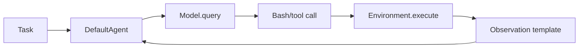
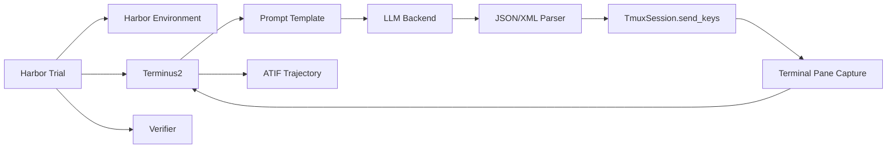
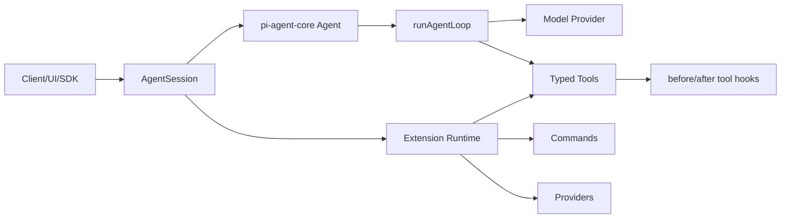

# Agent Framework Architecture and Extensibility Comparison

Date: 2026-04-26

## Scope

This report compares three agent systems from an architecture and extensibility standpoint:

1. `mini-swe-agent`, the current repository.
2. `Terminus2`, the concrete agent in Harbor at `src/harbor/agents/terminus_2/`.
3. `yudai-pi-mono`, especially `pi-agent-core` and `pi-coding-agent`.

The key distinction is that **Harbor is the evaluation framework** and **Terminus2 is one agent implementation inside Harbor**. Harbor provides trials, environments, configs, and verifiers. Terminus2 provides the agent loop that drives a persistent terminal.

Source revisions inspected:

| System | Revision |
| --- | --- |
| mini-swe-agent | `6e319c8a09d01e4ddfe82086a120cc5401abb918` |
| Harbor | `ff8d7661e7a047532a027eefca5d5cfb1251bf0d` |
| yudai-pi-mono | `05f79b08516809e0e06756013645c37419bf5570` |

Note: the local worktree had an existing modified `evmBench-frontier-evals` entry. It was not used or changed for this report.

## Methodology

The comparison was done by reading the agent loops, environment/model boundaries, parser/tool interfaces, config surfaces, and extension APIs for each system. For Harbor, the analysis intentionally separates the framework layer from the Terminus2 agent layer. For the two external repositories, source links are pinned to the inspected commits.

## Executive Summary

The three systems optimize for different architectural goals:

| System | Best Fit | Architectural Character |
| --- | --- | --- |
| mini-swe-agent | Small research baseline and fast iteration | Minimal `query -> execute -> observe` loop with simple protocols |
| Terminus2 inside Harbor | Evaluation realism and reproducible terminal tasks | Persistent `tmux` terminal agent integrated into Harbor trials |
| yudai-pi-mono / pi | Extensible agent product/runtime | Typed tools, events, providers, extensions, sessions, and UI/runtime hooks |

The most important design difference is the **action abstraction**:

- mini-swe-agent acts through tool calls, usually a `bash` tool.
- Terminus2 acts by typing raw keystrokes into a persistent terminal.
- pi acts through typed tools and an evented runtime.

That decision drives almost every downstream tradeoff: observability, error recovery, extensibility, context handling, interactivity, and ease of modification.

## Converged Comparison Factors

These are the factors that matter most for comparing agent architectures:

| Factor | Why It Matters |
| --- | --- |
| Control loop design | Determines how the agent thinks, acts, observes, and terminates. |
| Action/tool abstraction | Determines robustness, composability, and how new capabilities are added. |
| Environment abstraction | Determines how well the agent runs across local, Docker, benchmark, or remote sandboxes. |
| Model/provider abstraction | Determines how easily models and inference providers can be swapped. |
| Prompt/parser interface | Determines whether model-agent communication is brittle text or structured protocol. |
| Context and memory management | Determines whether long-running tasks survive context pressure. |
| Error recovery and timeout handling | Determines resilience to bad model output, failed commands, and stuck runs. |
| Observability, tracing, and replay | Determines whether failures can be debugged and evaluated reproducibly. |
| Evaluation/trial/verifier integration | Determines whether the system is naturally suited for benchmark execution. |
| Plugin and extension API | Determines whether new behavior can be added cleanly by third parties. |
| Configuration surface | Determines how much can be changed without source edits. |
| Complexity and maintainability cost | Determines how quickly engineers can understand and safely modify the system. |

## Architecture Flow

### mini-swe-agent

mini-swe-agent is intentionally small. The default agent loop lives in [`src/minisweagent/agents/default.py`](../src/minisweagent/agents/default.py#L37), with the main steps split into `run`, `query`, `get_observations`, and `execute_action`.

Core references:

- [`DefaultAgent`](../src/minisweagent/agents/default.py#L37)
- [`DefaultAgent.run`](../src/minisweagent/agents/default.py#L58)
- [`DefaultAgent.query`](../src/minisweagent/agents/default.py#L95)
- [`DefaultAgent.execute_action`](../src/minisweagent/agents/default.py#L128)
- [`Model`, `Environment`, and `Agent` protocols](../src/minisweagent/__init__.py#L41)
- [`get_environment`](../src/minisweagent/environments/__init__.py#L33)
- [`get_model`](../src/minisweagent/models/__init__.py#L45)
- [`LocalEnvironment.execute`](../src/minisweagent/environments/local.py#L23)
- [`LitellmModel.query`](../src/minisweagent/models/litellm_model.py#L111)
- [default YAML prompt/tool config](../src/minisweagent/config/default.yaml)

### Terminus2 Inside Harbor

Terminus2 is a **stateful terminal control loop**. It starts a `tmux` session in the Harbor environment, asks the model for structured JSON or XML, parses commands into keystrokes, sends those keystrokes into the terminal, captures the pane, and repeats.

Core Terminus2 references:

- [`Terminus2`](https://github.com/pranay5255/harbor/blob/ff8d7661e7a047532a027eefca5d5cfb1251bf0d/src/harbor/agents/terminus_2/terminus_2.py#L70)
- [`Terminus2.setup`](https://github.com/pranay5255/harbor/blob/ff8d7661e7a047532a027eefca5d5cfb1251bf0d/src/harbor/agents/terminus_2/terminus_2.py#L349)
- [`Terminus2._get_parser`](https://github.com/pranay5255/harbor/blob/ff8d7661e7a047532a027eefca5d5cfb1251bf0d/src/harbor/agents/terminus_2/terminus_2.py#L370)
- [`Terminus2._build_skills_section`](https://github.com/pranay5255/harbor/blob/ff8d7661e7a047532a027eefca5d5cfb1251bf0d/src/harbor/agents/terminus_2/terminus_2.py#L414)
- [`Terminus2._summarize`](https://github.com/pranay5255/harbor/blob/ff8d7661e7a047532a027eefca5d5cfb1251bf0d/src/harbor/agents/terminus_2/terminus_2.py#L735)
- [`Terminus2._handle_llm_interaction`](https://github.com/pranay5255/harbor/blob/ff8d7661e7a047532a027eefca5d5cfb1251bf0d/src/harbor/agents/terminus_2/terminus_2.py#L1173)
- [`Terminus2._execute_commands`](https://github.com/pranay5255/harbor/blob/ff8d7661e7a047532a027eefca5d5cfb1251bf0d/src/harbor/agents/terminus_2/terminus_2.py#L1216)
- [`Terminus2._run_agent_loop`](https://github.com/pranay5255/harbor/blob/ff8d7661e7a047532a027eefca5d5cfb1251bf0d/src/harbor/agents/terminus_2/terminus_2.py#L1248)
- [`Terminus2.run`](https://github.com/pranay5255/harbor/blob/ff8d7661e7a047532a027eefca5d5cfb1251bf0d/src/harbor/agents/terminus_2/terminus_2.py#L1558)
- [`Terminus2._dump_trajectory_with_continuation_index`](https://github.com/pranay5255/harbor/blob/ff8d7661e7a047532a027eefca5d5cfb1251bf0d/src/harbor/agents/terminus_2/terminus_2.py#L1888)

Parser and prompt references:

- [`terminus_json_plain_parser.py`](https://github.com/pranay5255/harbor/blob/ff8d7661e7a047532a027eefca5d5cfb1251bf0d/src/harbor/agents/terminus_2/terminus_json_plain_parser.py#L20)
- [`terminus_xml_plain_parser.py`](https://github.com/pranay5255/harbor/blob/ff8d7661e7a047532a027eefca5d5cfb1251bf0d/src/harbor/agents/terminus_2/terminus_xml_plain_parser.py#L20)
- [`terminus-json-plain.txt`](https://github.com/pranay5255/harbor/blob/ff8d7661e7a047532a027eefca5d5cfb1251bf0d/src/harbor/agents/terminus_2/templates/terminus-json-plain.txt)
- [`terminus-xml-plain.txt`](https://github.com/pranay5255/harbor/blob/ff8d7661e7a047532a027eefca5d5cfb1251bf0d/src/harbor/agents/terminus_2/templates/terminus-xml-plain.txt)
- [`timeout.txt`](https://github.com/pranay5255/harbor/blob/ff8d7661e7a047532a027eefca5d5cfb1251bf0d/src/harbor/agents/terminus_2/templates/timeout.txt)

Terminal execution references:

- [`TmuxSession`](https://github.com/pranay5255/harbor/blob/ff8d7661e7a047532a027eefca5d5cfb1251bf0d/src/harbor/agents/terminus_2/tmux_session.py#L12)
- [`TmuxSession.start`](https://github.com/pranay5255/harbor/blob/ff8d7661e7a047532a027eefca5d5cfb1251bf0d/src/harbor/agents/terminus_2/tmux_session.py#L429)
- [`TmuxSession.send_keys`](https://github.com/pranay5255/harbor/blob/ff8d7661e7a047532a027eefca5d5cfb1251bf0d/src/harbor/agents/terminus_2/tmux_session.py#L613)
- [`TmuxSession.capture_pane`](https://github.com/pranay5255/harbor/blob/ff8d7661e7a047532a027eefca5d5cfb1251bf0d/src/harbor/agents/terminus_2/tmux_session.py#L656)
- [`TmuxSession.get_incremental_output`](https://github.com/pranay5255/harbor/blob/ff8d7661e7a047532a027eefca5d5cfb1251bf0d/src/harbor/agents/terminus_2/tmux_session.py#L675)

Harbor framework references:

- [`BaseAgent`](https://github.com/pranay5255/harbor/blob/ff8d7661e7a047532a027eefca5d5cfb1251bf0d/src/harbor/agents/base.py#L12)
- [`AgentFactory`](https://github.com/pranay5255/harbor/blob/ff8d7661e7a047532a027eefca5d5cfb1251bf0d/src/harbor/agents/factory.py#L33)
- [`AgentFactory.create_agent_from_import_path`](https://github.com/pranay5255/harbor/blob/ff8d7661e7a047532a027eefca5d5cfb1251bf0d/src/harbor/agents/factory.py#L94)
- [`Trial`](https://github.com/pranay5255/harbor/blob/ff8d7661e7a047532a027eefca5d5cfb1251bf0d/src/harbor/trial/trial.py#L126)
- [`Trial.run`](https://github.com/pranay5255/harbor/blob/ff8d7661e7a047532a027eefca5d5cfb1251bf0d/src/harbor/trial/trial.py#L932)
- [`AgentConfig`](https://github.com/pranay5255/harbor/blob/ff8d7661e7a047532a027eefca5d5cfb1251bf0d/src/harbor/models/trial/config.py#L77)
- [`EnvironmentConfig`](https://github.com/pranay5255/harbor/blob/ff8d7661e7a047532a027eefca5d5cfb1251bf0d/src/harbor/models/trial/config.py#L99)

### yudai-pi-mono / pi

pi is the most product-runtime oriented system. It has a core agent loop, a coding-agent SDK/session layer, typed tools, extension APIs, provider registration, session compaction, steering/follow-up behavior, and runtime events.

Core references:

- [`AgentOptions`](https://github.com/pranay5255/yudai-pi-mono/blob/05f79b08516809e0e06756013645c37419bf5570/packages/agent/src/agent.ts#L94)
- [`Agent`](https://github.com/pranay5255/yudai-pi-mono/blob/05f79b08516809e0e06756013645c37419bf5570/packages/agent/src/agent.ts#L158)
- [`Agent.prompt`](https://github.com/pranay5255/yudai-pi-mono/blob/05f79b08516809e0e06756013645c37419bf5570/packages/agent/src/agent.ts#L313)
- [`runAgentLoop`](https://github.com/pranay5255/yudai-pi-mono/blob/05f79b08516809e0e06756013645c37419bf5570/packages/agent/src/agent-loop.ts#L95)
- [`executeToolCalls`](https://github.com/pranay5255/yudai-pi-mono/blob/05f79b08516809e0e06756013645c37419bf5570/packages/agent/src/agent-loop.ts#L338)
- [`beforeToolCall` / `afterToolCall` options](https://github.com/pranay5255/yudai-pi-mono/blob/05f79b08516809e0e06756013645c37419bf5570/packages/agent/src/types.ts#L209)
- [`createAgentSession`](https://github.com/pranay5255/yudai-pi-mono/blob/05f79b08516809e0e06756013645c37419bf5570/packages/coding-agent/src/core/sdk.ts#L180)
- [`AgentSession.prompt`](https://github.com/pranay5255/yudai-pi-mono/blob/05f79b08516809e0e06756013645c37419bf5570/packages/coding-agent/src/core/agent-session.ts#L942)
- [`AgentSession.steer`](https://github.com/pranay5255/yudai-pi-mono/blob/05f79b08516809e0e06756013645c37419bf5570/packages/coding-agent/src/core/agent-session.ts#L1156)
- [`AgentSession.followUp`](https://github.com/pranay5255/yudai-pi-mono/blob/05f79b08516809e0e06756013645c37419bf5570/packages/coding-agent/src/core/agent-session.ts#L1176)
- [`AgentSession.compact`](https://github.com/pranay5255/yudai-pi-mono/blob/05f79b08516809e0e06756013645c37419bf5570/packages/coding-agent/src/core/agent-session.ts#L1599)
- [`AgentSession.bindExtensions`](https://github.com/pranay5255/yudai-pi-mono/blob/05f79b08516809e0e06756013645c37419bf5570/packages/coding-agent/src/core/agent-session.ts#L2024)
- [`ExtensionAPI`](https://github.com/pranay5255/yudai-pi-mono/blob/05f79b08516809e0e06756013645c37419bf5570/packages/coding-agent/src/core/extensions/types.ts#L1069)
- [`ExtensionAPI.registerTool`](https://github.com/pranay5255/yudai-pi-mono/blob/05f79b08516809e0e06756013645c37419bf5570/packages/coding-agent/src/core/extensions/types.ts#L1117)
- [`ExtensionAPI.registerProvider`](https://github.com/pranay5255/yudai-pi-mono/blob/05f79b08516809e0e06756013645c37419bf5570/packages/coding-agent/src/core/extensions/types.ts#L1276)

## Comparison Matrix

| Factor | mini-swe-agent | Terminus2 inside Harbor | yudai-pi-mono / pi |
| --- | --- | --- | --- |
| Control loop design | Minimal loop: query model, execute action, append observation. Easy to read and replace. | Larger stateful loop with parsing, terminal execution, summaries, completion confirmation, and trajectory persistence. | Evented runtime loop with session layer, tool execution modes, hooks, queueing, and compaction. |
| Action/tool abstraction | Tool call abstraction, commonly one bash tool call per turn. | Raw keystroke abstraction sent into `tmux`. Behaves like a human using a terminal. | Typed tools with schemas, sequential/parallel execution, before/after hooks, and extension registration. |
| Environment abstraction | Simple `Environment` protocol and registry. | Strong environment abstraction from Harbor; agents run inside benchmark environments. | More runtime/session oriented; environment is typically represented through tools and app/runtime integrations. |
| Model/provider abstraction | Model protocol plus registry, with LiteLLM adapter. | LiteLLM and Tinker support in Terminus2; model options are config driven. | Strong provider abstraction, provider registration, model selection events, and runtime settings. |
| Prompt/parser interface | Prompt templates and tool schema. Low ceremony. | Explicit JSON/XML response formats, dedicated parsers, parser feedback, and prompt templates. | Structured tool/runtime APIs reduce dependence on ad hoc parsing. |
| Context management | Minimal by default. Observation truncation exists in config. | Built-in proactive and fallback summarization, including subagent-style summary/question/answer handoff. | Session compaction, threshold/overflow handling, and extension hooks around compaction. |
| Error recovery | Simple format error prompt and step limits. | Parser warnings/errors, malformed response recovery, timeout handling, context overflow handling, truncated XML salvage. | Retry, hooks, runtime events, compaction recovery, and extension-level intervention. |
| Observability | Saves history/result but relatively sparse. | Strong eval observability: ATIF trajectory, rollout details, terminal pane capture, optional asciinema integration. | Strong product/runtime observability through events and session state; less eval-native by default. |
| Evaluation integration | Can run benchmarks, but the core is a lightweight agent baseline. | Strongest. Harbor has trials, configs, environments, task execution, and verifiers. | Weakest by default. It is a runtime, not an evaluation harness. |
| Plugin/extension API | Minimal. Extend by adding protocols/classes/config. | Harbor supports custom agents/environments through import paths. Terminus2 itself is not a plugin runtime. | Strongest. Extensions can register tools, commands, providers, handlers, UI elements, and context behavior. |
| Configuration surface | YAML-centric and simple. | Broad agent config plus Harbor trial/environment config. | Large settings/session/runtime/extension surface. |
| Complexity cost | Lowest. | Medium-high because terminal state, parser recovery, context handling, and Harbor lifecycle interact. | Highest because it is a full platform/runtime, not just an agent loop. |

## Scored View

Scores are relative, from 1 to 5, for this comparison only.

| Factor | mini-swe-agent | Terminus2 inside Harbor | yudai-pi-mono / pi |
| --- | ---: | ---: | ---: |
| Ease of understanding | 5 | 3 | 2 |
| Ease of modifying the core loop | 5 | 3 | 2 |
| Terminal realism | 2 | 5 | 3 |
| Typed tool extensibility | 3 | 2 | 5 |
| Environment/eval integration | 3 | 5 | 2 |
| Provider extensibility | 3 | 3 | 5 |
| Context management | 2 | 4 | 4 |
| Observability/replay | 2 | 5 | 4 |
| Error recovery | 2 | 4 | 4 |
| Product/runtime extensibility | 2 | 2 | 5 |

## Detailed Findings

### mini-swe-agent

mini-swe-agent is architecturally valuable because it is small. The important abstractions are easy to locate:

- `Agent`
- `Model`
- `Environment`
- YAML config
- model/environment registries

This makes it a strong baseline for experiments where the agent loop itself is the thing being changed. It is also easy to reason about failure modes because there are fewer layers.

Strengths:

- Very low complexity.
- Clear control loop.
- Easy to swap model/environment classes.
- Good for experiments and focused variants.
- Minimal hidden behavior.

Limitations:

- Less built-in observability.
- Less robust long-context handling.
- Less support for interactive terminal state.
- No broad plugin/event system.
- Extension often means changing code or adding classes, not registering behavior through a runtime API.

Architectural read: mini-swe-agent is the best **minimal research substrate**, but not the strongest long-running eval runtime or extensible product platform.

### Terminus2 Inside Harbor

Terminus2 should be understood as an **agent implementation optimized for evaluation realism**.

Its strongest choice is using `tmux`. This means the agent sees a persistent terminal and can interact with stateful shell programs, editors, REPLs, setup flows, and long-running commands in a more human-like way than a stateless bash tool call.

Its second strongest choice is the explicit parser/template layer. The model does not free-form its actions. It must emit JSON or XML with analysis, plan, commands, durations, and optional completion. That gives the agent a place to detect malformed output and ask the model to correct itself.

Strengths:

- Strong terminal realism.
- Works naturally inside Harbor trials.
- Persistent terminal state via `tmux`.
- Rich trajectory and rollout artifacts.
- Parser feedback for malformed model output.
- Better timeout and context pressure handling than mini-swe-agent.
- Supports skills and MCP descriptions through prompt augmentation.

Limitations:

- Raw keystrokes are powerful but less semantically typed than tools.
- Extension points are mostly internal: parser, template, environment, LLM backend, config, summarization, trajectory.
- Not a broad plugin runtime.
- More moving parts than mini-swe-agent.
- Debugging can require understanding Harbor lifecycle plus Terminus2 loop plus `tmux` behavior.

Architectural read: Terminus2 is the best **evaluation agent** among the three, especially when task fidelity depends on a real terminal. Harbor gives it the surrounding trial/verifier machinery.

### yudai-pi-mono / pi

pi is architected as an **agent runtime and product platform**. It has the strongest extension surface:

- typed tools
- lifecycle events
- before/after tool hooks
- provider registration
- extension commands
- session APIs
- steering/follow-up queues
- compaction
- runtime state

This is a different design center from Harbor. pi is not primarily an evaluation harness. It is better suited to building an agent product, IDE-like agent environment, or extensible assistant runtime.

Strengths:

- Strongest extension API.
- Typed tools and schemas.
- Tool hooks support policy, tracing, mutation, or blocking.
- Provider extensibility is first-class.
- Session APIs support interactive product behavior.
- More suitable for third-party extensions.

Limitations:

- Highest complexity.
- Less eval-native than Harbor.
- More architecture to understand before making safe changes.
- If the goal is benchmark reproducibility, additional harness/verifier work is needed.

Architectural read: pi is the best **extensible runtime**, but not the simplest research baseline or most eval-native framework.

## Terminus2 Versus Harbor

This distinction matters enough to call out separately.

Harbor provides:

- task/trial lifecycle
- environment creation
- agent creation
- verifier execution
- config models
- import-path based extensibility

Terminus2 provides:

- terminal session startup
- prompt construction
- model interaction
- JSON/XML parsing
- terminal keystroke execution
- terminal observation capture
- context summarization
- trajectory recording

So when comparing extensibility:

- **Harbor extensibility** means adding agents, environments, tasks, verifiers, and trial configs.
- **Terminus2 extensibility** means changing how one terminal-driving agent prompts, parses, executes, summarizes, and records.

Those are different layers.

## Recommendations

### If the goal is benchmark evaluation quality

Use Harbor plus Terminus2 as the baseline. It gives the best combination of environment lifecycle, persistent terminal interaction, trajectory capture, and verifier integration.

Main improvement areas:

- Add cleaner event hooks around parser output, command execution, observation capture, and completion.
- Consider typed command abstractions for common operations while retaining raw keystroke fallback.
- Make parser/template registration more explicit so new action grammars can be added without touching the core loop.
- Expose trajectory/rollout metadata as a stable extension contract.

### If the goal is fast agent research

Use mini-swe-agent as the baseline. It is easier to fork, mutate, and reason about.

Main improvement areas:

- Add optional richer tracing.
- Add optional context summarization.
- Keep the base loop small; do not import a large plugin system unless needed.
- Use Terminus2 only if terminal interactivity is central to the experiment.

### If the goal is an extensible agent product

Use pi as the architectural reference. Its extension API, provider registry, typed tools, and session management are much stronger than the other two.

Main improvement areas if adapting it for evals:

- Add a Harbor-like trial/verifier layer.
- Add deterministic artifact layout for runs.
- Add benchmark-oriented environment adapters.
- Add stronger reproducibility metadata.

## Final Ranking by Use Case

| Use Case | Best Choice | Reason |
| --- | --- | --- |
| Reproducible benchmark trials | Terminus2 inside Harbor | Harbor gives trials/verifiers; Terminus2 gives terminal realism. |
| Human-like terminal task solving | Terminus2 | Persistent `tmux` state is the closest match. |
| Small baseline for experiments | mini-swe-agent | Lowest complexity and easiest loop to change. |
| Building an extensible agent runtime | pi | Strongest plugin, provider, tool, and event APIs. |
| Tool ecosystem extensibility | pi | Typed tools and extension registration are first-class. |
| Quick source-level customization | mini-swe-agent | Fewer layers and lower cognitive load. |
| Rich eval observability | Terminus2 inside Harbor | Trajectories, rollout details, terminal capture, and verifier context. |

## Bottom Line

The three systems should not be treated as competitors on a single axis.

- **mini-swe-agent** is the clean minimal baseline.
- **Terminus2** is the terminal-realistic evaluation agent.
- **Harbor** is the evaluation framework around Terminus2.
- **pi** is the extensible product/runtime architecture.

The right architectural direction depends on the target:

- For evals: build around Harbor and Terminus2.
- For agent-loop research: keep mini-swe-agent small and focused.
- For extensible products: use pi's extension/runtime architecture as the reference.
